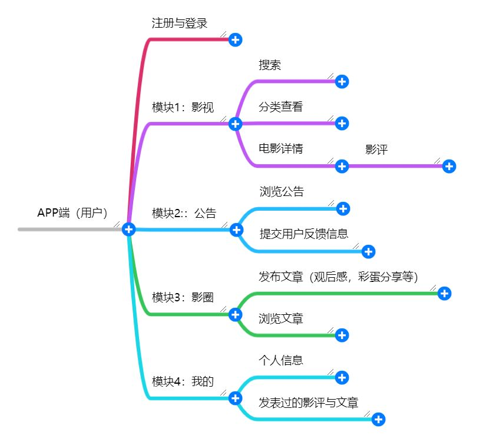
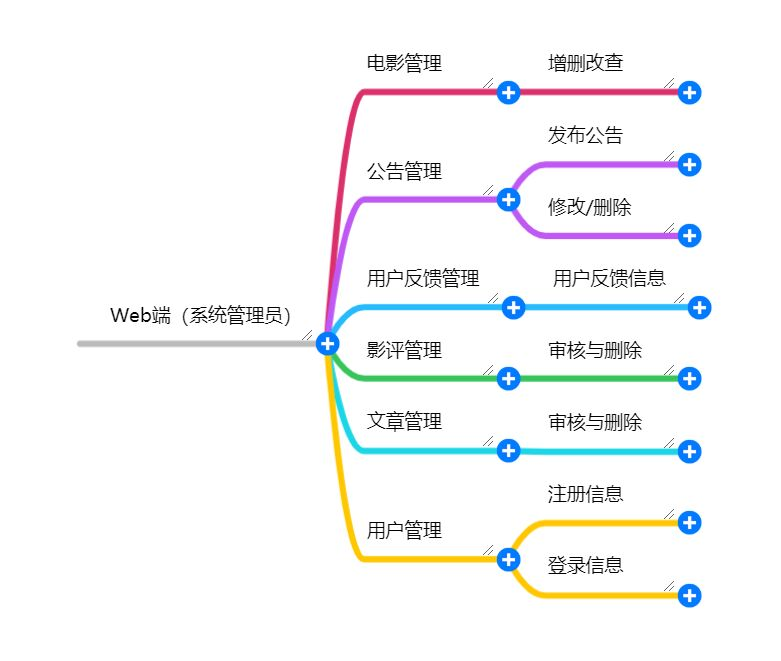

# 电影推荐点评后端实现

### 功能导图
> * APP端

 > * WEB端

### 部署说明
项目路径 src/main/resources/sql 中存在 3个SQL文件 
 * 1. movie_review_backend.sql 项目的数据结构相关文件,复制或者导入到Mysql数据库中
 * 2. 打开数据库右键属性 运行SQL文件
 * 3. 同理导入分类的数据
 
 #### 2. 完成数据库的创建后
 完成项目路径 src/main/resources/application.properties 的数据库在内的相关配置 具体看说明
 
 #### 3. 项目DEBUG
 项目是maven项目, 启动类在 MovieReviewBackendApplication 直接执行main函数就可以运行
 
 #### 4.项目打包
 maven项目
 依次点击 clean package
  会在项目打包 并在项目路径 target/backend-0.0.1-SNAPSHOT.jar 生成对应的jar包
  
  #### 5. 项目部署
  安装Java下 命令行 java -jar backend-0.0.1-SNAPSHOT.jar
  
  #### 后台运行
  创建bat文件
  @echo off
  start java -jar backend-0.0.1-SNAPSHOT.jar
  exit
  启动bat就可
 
  
